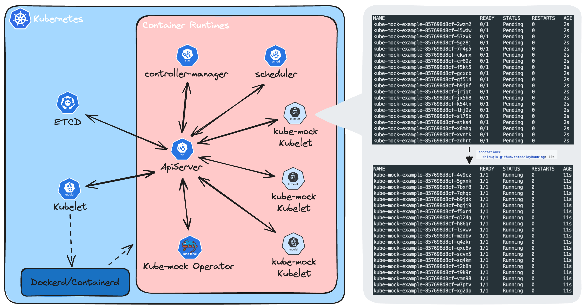

# Kube-mock


Kube-mock 是一个基于 [virtual-kubelet](https://github.com/virtual-kubelet/virtual-kubelet) 的 Kubernetes Kubelet 实现，它伪装成 Kubelet 模拟 pod 运行状态的变化。

---

## Description

整个系统由以下几个组件组成：

- [manager](doc/manager.md) 是个 Operator，负责调协 `Nodes.mock.zhizuziu.cn` 自定义资源，进行相应 kube-mock kubelet 的创建和删除。
- [node](doc/node.md) 伪装成 Kubelet，并模拟 pod 运行状态的变化。
- [tools](doc/tools.md) 提供了一些工具。
- - `mock` 命令用于读取 apiserver ，生成 kubernetes node 对应的 `Nodes.mock.zhizuziu.cn` yaml 资源文件



---

## Getting Started

一个简单的 mock kubelet 可以使用如下资源进行创建：

```yaml
apiVersion: mock.zhizuqiu.cn/v1alpha1
kind: Node
metadata:
  name: node-sample
  namespace: kube-mock-system
spec:
  suspend: false # 是否停止 kubelet 
  image: "zhizuqiu/kube-mock:v1alpha1"
  kubeconfigSecret: "kube-mock-node" #  用于 kubelet 连接的 kubeconfig 文件
  nodeSelector:
    node-role.kubernetes.io/control-plane: ""
  tolerations:
    - key: node-role.kubernetes.io/control-plane
      operator: Exists
      effect: NoSchedule
  nodeConfig: # kubelet 配置
    cpu: '128'
    memory: '300Gi'
    pods: '50'
```


通过为 pod 指定 `Annontation` 来定义 pod 运行状态改变的行为：

```yaml
apiVersion: apps/v1
kind: Deployment
metadata:
  name: kube-mock-example
spec:
  replicas: 20
  selector:
    matchLabels:
      app: kube-mock-example
  template:
    metadata:
      labels:
        app: kube-mock-example
      annotations:
        zhizuqiu.github.com/delayRunning: 10s
    spec:
      containers:
        - image: zhizuqiu/dispatch-client:latest
          name: container-0o8ycf
          resources:
            requests:
              cpu: 100m
              memory: 20Mi
            limits:
              cpu: 100m
              memory: 20Mi
```

以上通过 `zhizuqiu.github.com/delayRunning` 定义了在 pod 创建后 10s 开始模拟 pod 运行状态的变化。

提交后：


提交后 10s：


类似的 `Annotation` 还有：

- `zhizuqiu.github.com/delayRunning`：自 pod 创建起，运行状态变为 `Running` 的延迟时间
- `zhizuqiu.github.com/delaySucceeded`：自 pod 创建起，运行状态变为 `Succeeded` 的延迟时间
- `zhizuqiu.github.com/delayFailed`：自 pod 创建起，运行状态变为 `Failed` 的延迟时间
- `zhizuqiu.github.com/mockStatus`：更加灵活的方式，pod 的运行状态变由 `MockStatus` 自定义资源进行定义，通过此 `Annotation` 与指定的 `MockStatus` 进行关联 【待实现】

---

### Running on the cluster

1. Deploy the controller to the cluster:

```sh
kubectl apply -f hack/crd/deploy.yaml
```

2. Install Instances of Custom Resources:

```sh
kubectl -n kube-mock-system create secret generic kube-mock-node --from-file=config=[path/to/kubeconfig]
kubectl apply -f hack/cr/mock_v1alpha1_node.yaml
```

---

### Uninstall CRDs
To delete the CRDs from the cluster:

```sh
kubectl delete -f hack/crd/deploy.yaml
```

---

### Build

1. Build and push image:

```sh
docker buildx build -f Dockerfile -t zhizuqiu/kube-mock:v1alpha1 --platform=linux/amd64,linux/arm64 . --push
```

2. Generate the Deployment yaml:
```sh
make create-deploy-yaml IMG=zhizuqiu/kube-mock:v1alpha1
```

---

## License

Copyright 2024.

Licensed under the Apache License, Version 2.0 (the "License");
you may not use this file except in compliance with the License.
You may obtain a copy of the License at

    http://www.apache.org/licenses/LICENSE-2.0

Unless required by applicable law or agreed to in writing, software
distributed under the License is distributed on an "AS IS" BASIS,
WITHOUT WARRANTIES OR CONDITIONS OF ANY KIND, either express or implied.
See the License for the specific language governing permissions and
limitations under the License.

